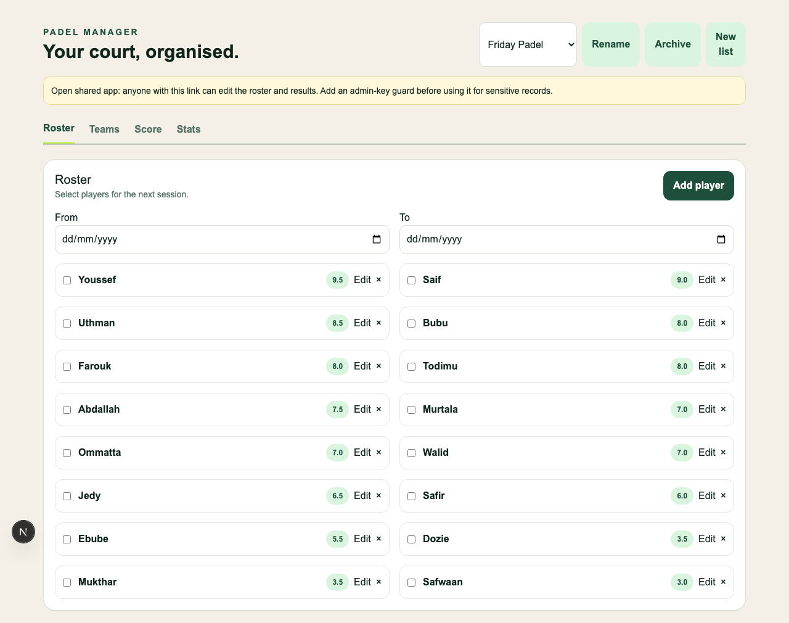

# Padel Manager

A mobile-first, open-source app for organising recreational padel: keep a roster, form fair teams, run sessions, score live matches and review results. It is intentionally unauthenticated and is suitable for a trusted group, not private records.



## Run locally

```bash
cp .env.example .env
docker compose up -d
npm install
npx prisma migrate dev
npm run db:seed
npm run dev
```

Open [http://localhost:3000](http://localhost:3000). The idempotent seed creates the Friday Padel list and its editable 16-player roster. Run `npm run format:check`, `npm test`, `npm run typecheck`, `npm run lint`, `npm run test:e2e`, and `npm run build` before submitting changes.

## What it does

- Multiple isolated lists with validated 1.0–10.0 ratings and soft-deleted players.
- Snapshot-based sessions with fixed two-person teams and explicit benching for an odd roster.
- A testable team balancer, forced/blocked pair constraints, and support for lineup exclusion during reshuffles.
- Persistent, append-only score events; advantage or golden-point games; race-to-3, race-to-6, and standard best-of-3; undo until result confirmation.
- Round robin, knockout, winner-stays-on and group-to-knockout session progression. One live court is atomically activated at a time.
- Per-player expected-performance, W/L, streak, partner, head-to-head and coverage-aware clutch data. Clutch data is deliberately only shown from point-by-point matches.
- Formatted text sharing, clipboard/native sharing compatible output, and WhatsApp fallback URLs.

## Architecture

Next.js App Router provides server-rendered initial data and explicit REST route handlers. Zod validates external input. Prisma handles PostgreSQL storage. The `src/lib` modules own pure scoring, team, format, stats and sharing rules so they can be tested independently of React and database access. Sessions copy player names and ratings into `Participant` records so later roster edits cannot alter history.

The app is public-write by design: anyone who can reach the deployment can alter content. A future optional `ADMIN_WRITE_KEY` middleware can protect writes without adding a complete identity system.

## Deploy

Create a Neon PostgreSQL database and set its pooled connection as `DATABASE_URL` and direct connection as `DIRECT_URL` in Vercel, then run `npx prisma migrate deploy` and `npm run db:seed` once against that database. Vercel detects Next.js and deploys pull-request previews automatically when connected to GitHub. Production should track `main`; work belongs on `feat/*`, `fix/*`, `chore/*`, `test/*`, or `docs/*` branches.

## Deliberately out of scope

Authentication, realtime synchronization, multiple concurrent courts, player side tracking, automatic rating changes, Americano, Mexicano, reset controls, and fabricated demo match history.

## Decisions

See [ADRs](docs/adr) for event-based scoring, historical snapshots, format state machines, and statistics coverage.
